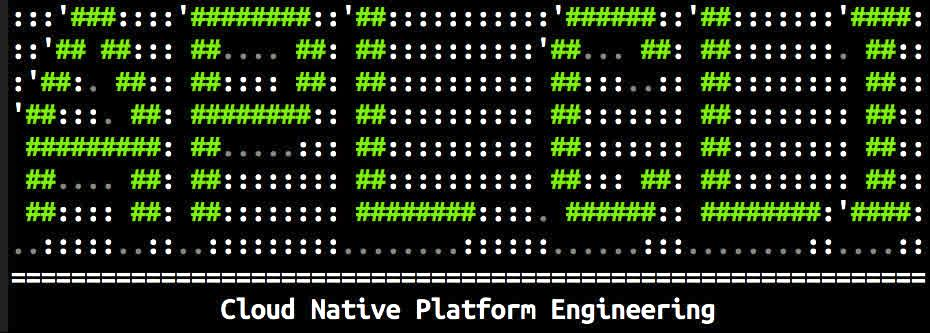
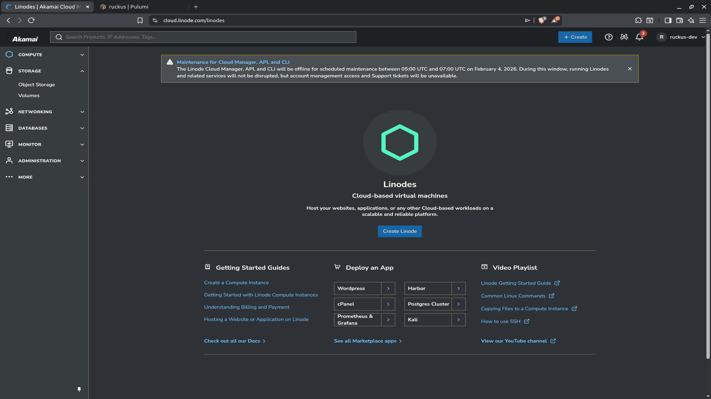
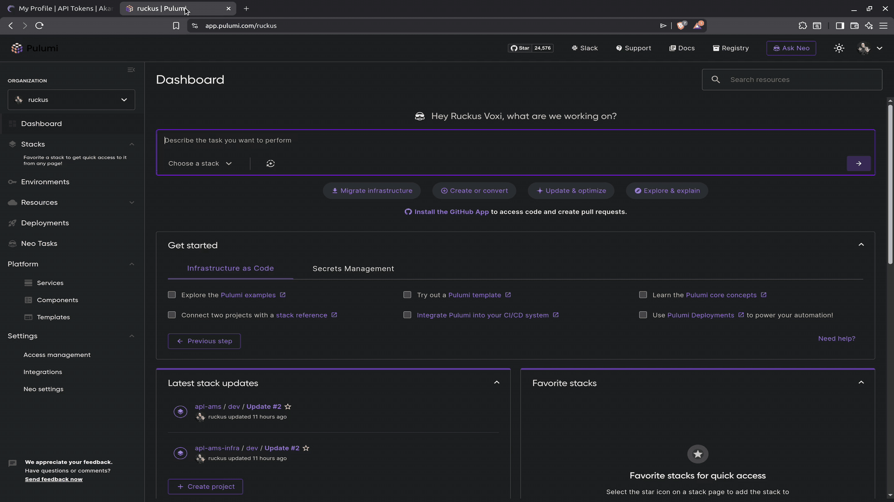

Simplify your Platform Engineering experience with a CLI tool! Everyone wants
to reduce toil for developers, but let's not forget the toil such an endeavor
can incur for platform teams. Where the 12-Factor App principals intersect
with the Don't Reinvent the Wheel (DRW) philosophy, lies the perfect spot for
a CLI tool to address that concern. Furthermore, it should be customizable,
extensible, stateless, and easily integrable with event-driven applications
and CI/CD pipelines.

In those regards, `aplcli` comes packed with default templating and codegen to
produce bootstrapped, repeatable deployments of the [Akamai App
Platform](https://apl-docs.net/) (APL)―a Kubernetes-based, production ready developer platform
built entirely with CNCF projects. 

APL provides a pre-configured multi-tenant _teams_ experience, GitOps, and
other IDP essentials out of the box. It functions like one large golden path
template for the entire platform, launching you right into day-2 operations.
It's a fully open source solution for platform teams and cloud-native
application developers alike.

Still not good enough? You're right, because even polished platforms like APL
can bear an undesirable amount of weight to carry at scale (albeit the very
problem they aim to solve). That's where something `aplcli` steps in to
improve your quality of life. It enables effortless deployment of
_multiple_ instances of APL all over the world within minutes. Just as quickly,
you can tear them back down, rebuild, and re-provision.

Modify to your heart's desire and happy Platform Engineering!

## Overview

This repo demonstrates a flexible CLI tool that facilitates code generation
and management of multiple infrastructure as code (IaC) projects for
deploying declarative, reproducible Internal Developer Platforms (IDP) on
Kubernetes. It is written in pure Go, leveraging independent but synergistic
libraries and tooling.

[Cobra](https://github.com/spf13/cobra)
provides the skeletal structure and feature set for building powerful,
enterprise grade CLIs. Created by [Steve Francia (spf13)](https://spf13.com/), it's battle tested and used by many [popular open
source
projects](https://github.com/spf13/cobra/blob/main/site/content/projects_using_cobra.md),
including Kubernetes, Hugo, Rclone, Dapr, and Pulumi! My Akamai colleague [Thorsten
Hans](https://github.com/ThorstenHans) also wrote an excellent
[tutorial](https://www.thorsten-hans.com/lets-build-a-cli-in-go-with-cobra/)
on getting started with Cobra.

[Viper](https://github.com/spf13/viper) is a robust configuration solution.
It's also authored by Steve Francia and seen in the wild supporting with
many open source projects. Viper works in concert with Cobra, providing a seamless flow between these
decoupled components―an important complement to 12-Factor Apps! It further
complements by providing a single configuration pane of glass with
a predictable value override precedence.

[Pulumi](https://github.com/pulumi/pulumi) is an Infrastructure as Code
(IaC) solution that brings both declarative and imperative elements, using
[SDKs](https://www.pulumi.com/docs/iac/languages-sdks/) in the familiar
programming languages we know and love. additionally it supports both YAML
and HCL configuration languages. This project uses the [Golang
SDK](https://github.com/pulumi/pulumi/tree/master/sdk/go) and [Linode
provider](https://www.pulumi.com/registry/packages/linode/), along with
[ESC](https://github.com/pulumi/esc)―Pulumi's central secrets management
service.


## Technology Stack

- **Linode Kubernetes Engine (LKE):** Three-node cluster of (default 16GB) compute instances and [HA control plane](https://techdocs.akamai.com/cloud-computing/docs/high-availability-ha-control-plane-on-lke)
- **DNS:** Custom primary domain zone in Linode DNS Manager
- **Cloud Load Balancer:** Linode/Akamai [NodeBalancer](https://techdocs.akamai.com/cloud-computing/docs/nodebalancer)
- **Backup and app state backends:** Linode Object Storage (S3-compatible)
- **Storage:** NVMe Block Storage (PVs) via [Linode CCM](https://github.com/linode/linode-cloud-controller-manager)
- **Deployment:** Akamai App Platform
- **CNCF Applications:** All of the [core apps](https://github.com/linode/apl-core?tab=readme-ov-file#integrations) plus Alertmanager, Grafana, Harbor, Loki,  Prometheus, and Tempo
- **Infrastructure:** Pulumi IaC for Linode resource provisioning

## Prerequisites

Software dependencies:
- [Go (v1.24.1+)](https://go.dev/doc/install)
- [Pulumi CLI](https://www.pulumi.com/docs/get-started/download-install/)
- [`kubectl`](https://kubernetes.io/docs/tasks/tools/)

Account prerequisites:

- **Linode account:** Provider for cloud infrastructure resources ([login or create account](https://login.linode.com/signup))
- **Bring Your Own Domain (BYOD):** Custom domain pointed to [Linode's name servers](https://techdocs.akamai.com/cloud-computing/docs/getting-started-with-dns-manager#use-linodes-name-servers)
- **Pulumi Cloud account:** Backend for IaC resource state, configuration and secrets management ([login or create account](https://app.pulumi.com/signup))


## Deployment Steps

### 1. Clone this repository

Clone the repository to your local machine, review the code and make
changes as desired, build and install.

```bash
git clone https://github.com/akamai-developers/aplcli.git
cd aplcli/

go install

# execute without installing binary (useful for development)
# go run main.go

# if a smaller binary or a different path is desired
# go build -ldflags="-s -w" -o path/to/aplcli
```


### 2. Create a Linode API key

In the Akamai Cloud console, create a Linode API key with **read/write** permissions for `Domains`, `Linodes`, `Kubernetes`, `NodeBalancers`, `Object Storage`, `Volumes`, and **read** permissions for `Events`.
____

([Go to high-resolution screencast](./media/screencasts/01-linode-api-key.mp4))
____

### 3. Create a Pulumi access token

In the Pulumi Cloud console, create a personal access token and copy it.

____

([Go to high-resolution screencast](./media/screencasts/02-pulumi-api-key.mp4))
____

### 4. Set environment variables

Add both your Linode and Pulumi API tokens to your shell environment.

```bash
export LINODE_TOKEN=<TOKEN>
export PULUMI_ACCESS_TOKEN=<TOKEN>

# ex: update shell profile (~/.bashrc or ~/.bash_profile)
echo >> ~/.bashrc
echo "# APL CLI" >> ~/.bashrc
echo "export LINODE_TOKEN=$LINODE_TOKEN" >> ~/.bashrc
echo "export PULUMI_ACCESS_TOKEN=$PULUMI_ACCESS_TOKEN" >> ~/.bashrc
```

### 5. Initialize your config

The CLI itself is stateless, only running with what it can find in a
corresponding configuration file. Run the application with the
`init` command to launch an interactive prompt for generating a new
config file. Your config will be written to
`$HOME/.aplcli/config.yaml`.

The prompt will ask for a domain name and primary email address for
the SOA, and for any future `certbot` certificate requests. We'll
also be asked to give our platform a unique name, and pick a cloud
region to deploy it. Perhaps the core of our development team lives
in or around Amsterdam, so let's select that region from the options
menu, and name it something like `apl-ams`.

> [!NOTE]
> - This is intended to only run once, to generate an initial config
file and application directory. Subsequent invocations of this
command will overwrite an existing config.
> - Be sure to choose a unique name for your platform in order to
avoid unintentional overwriting of other files on your system 
(i.e. kubeconfig).

```
aplcli init
```

The auto-generated config ends up looking something like this, with
values for `domain`, `email`, `name` and `region` populated via the
inputs provided to the prompt. This is your central configuration
for all projects moving forward. We'll update this later with a
definition for a second IDP that is located in a different
geographical region, but for now let's just focus on our Amsterdam
platform.

```yaml
# aplcli config
defaults:
  - &email ruckus@akamai.com
  - &region nl-ams
  - &values values.tpl

# pulumi cloud username/organization
pulumiOrg: ruckus

platform:
  - name: apl-ams
    domain: ams.arch-linux.io
    email: *email 
    region: *region
    repo: github.com/akamai-developers/aplcli
    values: *values
  # aplVersion:
  # kubeVersion:  
  # nbTag:        
  # nodeCount:
  # nodeMax:      
  # nodeType:     
  # objPrefix:    
  # stack:  
  # tags: []
```

___

([Go to high-resolution screencast](./media/screencasts/03-cli-init.mp4))
____

### 6. Generate project code

With our config file in place, we're ready to create the projects it defines!
Just fire off the `create` command with `--name <name>` and watch the show!

> [!NOTE]
> Replace `<name>` with the `name` value in your config file.

```bash
  aplcli create --name apl-ams
```
____

([Go to high-resolution screencast](./media/screencasts/04-cli-create-ams.mp4))
____

This command generates the project scaffolding, including all the
Pulumi project and helper code, APL secrets, and initialization of the Pulumi ESC
environment. The Pulumi specific code is divided into independent
[stacks](https://www.pulumi.com/docs/iac/concepts/stacks/)―one for
cloud infrastructure (infra) and the other for the
Kubernetes environment (apl)―which the [Pulumi Automation
API](https://www.pulumi.com/docs/iac/using-pulumi/automation-api/)
orchestrates together as a set of [micro
stacks.](https://www.pulumi.com/docs/iac/using-pulumi/organizing-projects-stacks/#micro-stacks)

```bash
.aplcli/
├── config.yaml
└── platforms
    ├── apl-ams
    │   ├── cmd
    │   │   ├── apl
    │   │   │   ├── app
    │   │   │   │   ├── app.go
    │   │   │   │   └── kube.go
    │   │   │   ├── helm
    │   │   │   │   └── values.tpl
    │   │   │   ├── main.go
    │   │   │   ├── Pulumi.dev.yaml
    │   │   │   └── Pulumi.yaml
    │   │   └── infra
    │   │       ├── app
    │   │       │   ├── app.go
    │   │       │   ├── dns.go
    │   │       │   ├── lke.go
    │   │       │   ├── nodebalancer.go
    │   │       │   └── obj.go
    │   │       ├── main.go
    │   │       ├── Pulumi.dev.yaml
    │   │       └── Pulumi.yaml
    │   ├── go.mod
    │   ├── go.sum
    │   └── utils
    │       ├── esc.go
    │       ├── logger.go
    │       ├── rclone.go
    │       ├── stackref.go
    │       └── utils.go
    └── values
        ├── values-example.tpl
        └── values.tpl
```

If you look back at your Pulumi Cloud account, you should see the ESC
environment has been created and populated with secrets for the
platform to consume.

____


([Go to high-resolution screencast](./media/screencasts/05-pulumi-esc-create.mp4))
____

### 7. Deploy the platform!

Run the `deploy` command and watch your platform come to life! Just
as with the `create` command, this requires the `--name` flag to
identify exactly which platform to act on. This lask of assumption
about what you want, becomes increasingly important as you increase
the number of platforms definitions in your config.

```bash
aplcli deploy --name apl-ams
```

____

([Go to high-resolution screencast](./media/screencasts/06-cli-deploy-ams.mp4))
____

As noted in a previous step, the two Pulumi micro stacks at play are
`infra` and `apl`. Sometimes it's desirable to target just one of
them, such ans for development, or error handling of edge-cases.
Simply tack on `--target <stack name>` when this behaviour is
warranted.

```bash
# example of deploying only the "infra" stack
aplcli deploy --name apl-ams --target infra
```

### 8. Add another platform

Well, that was exorbitantly easy... so let'ss deploy another! Perhaps we
assembled a new dev team that is based in Seattle, with focus is on an
entirely different product. It would be convenient to simply put them on
a different node pool, but still share the same Kubernetes cluster with
the Amsterdam team. Unfortunately, those regulatory sticklers are just
not having it. There is no way around it. We have to give them a
dedicated cluster in their region. Luckily, our beloved `aplcli` makes
that a breeze!


Back to our config file, append the Seattle cluster definition to the
`platform` array. At minimum it requires a unique platform `name`
and `domain` to avoid conflicts with the Amsterdam cluster, but in
this scenario we also need to explicitly declare a different region.
The product this team works on is a little more resource intensive,
so let's also give the node pool some extra juice. Although not
a requirement, we'll probably thank ourselves later if we also give
it some unique tags.

```yaml
platform:
...
  - name: apl-sea
    domain: sea.arch-linux.io
    email: *email 
    region: *region
    repo: github.com/akamai-developers/aplcli
    values: *values
    nbTag: seattle-apl-loadbal        
    nodeCount: 5
    nodeMax: 10    
    nodeType: g6-dedicated-16     
    objPrefix: seatac-apl   
    stack: prod
    tags:
      - seattle
      - apl
      - prod
      - regulatory-sticklers
```

___

([Go to high-resolution screencast](./media/screencasts/07-cli-add-sea.mp4))
___

Run the `create` command again with the name of our new project.

```bash
aplcli create --name apl-sea
```
____

([Go to high-resolution screencast](./media/screencasts/08-cli-create-sea.mp4))
____

Yes, more codegen! Notice how it's written to its own namespace
within the configuration directory, keeping it separate from other
projects like it. Ideally you can and **should** version them
separately as well. A good platform engineering CLI tool is one that
aims to make that as simple as possible!

If it helps to help visualize where we're at, here is a tree view of
what we've done so far.

```bash
tree ~/.aplcli
...
/home/ruckus/.aplcli/
├── config.yaml
└── platforms
    ├── apl-ams
    │   ├── cmd
    │   │   ├── apl
    │   │   │   ├── app
    │   │   │   │   ├── app.go
    │   │   │   │   └── kube.go
    │   │   │   ├── helm
    │   │   │   │   └── values.tpl
    │   │   │   ├── main.go
    │   │   │   ├── Pulumi.dev.yaml
    │   │   │   └── Pulumi.yaml
    │   │   └── infra
    │   │       ├── app
    │   │       │   ├── app.go
    │   │       │   ├── dns.go
    │   │       │   ├── lke.go
    │   │       │   ├── nodebalancer.go
    │   │       │   └── obj.go
    │   │       ├── main.go
    │   │       ├── Pulumi.dev.yaml
    │   │       └── Pulumi.yaml
    │   ├── go.mod
    │   ├── go.sum
    │   └── utils
    │       ├── esc.go
    │       ├── logger.go
    │       ├── rclone.go
    │       ├── stackref.go
    │       └── utils.go
    ├── apl-sea
    │   ├── cmd
    │   │   ├── apl
    │   │   │   ├── app
    │   │   │   │   ├── app.go
    │   │   │   │   └── kube.go
    │   │   │   ├── helm
    │   │   │   │   └── values.tpl
    │   │   │   ├── main.go
    │   │   │   ├── Pulumi.prod.yaml
    │   │   │   └── Pulumi.yaml
    │   │   └── infra
    │   │       ├── app
    │   │       │   ├── app.go
    │   │       │   ├── dns.go
    │   │       │   ├── lke.go
    │   │       │   ├── nodebalancer.go
    │   │       │   └── obj.go
    │   │       ├── main.go
    │   │       ├── Pulumi.prod.yaml
    │   │       └── Pulumi.yaml
    │   ├── go.mod
    │   ├── go.sum
    │   └── utils
    │       ├── esc.go
    │       ├── logger.go
    │       ├── rclone.go
    │       ├── stackref.go
    │       └── utils.go
    └── values
        ├── values-example.tpl
        └── values.tpl
```

You know what's next! Fire off that `deploy` command and give those
regulatory sticklers exactly what they asked for. Maybe they'll
change their minds when budget enters the conversation again ¯\_(ツ)_/¯. 

```bash
aplcli deploy --name apl-sea
```
___

([Go to high-resolution screencast](./media/screencasts/09-cli-deploy-sea.mp4))
___

In 20 minutes or less, we now have two entirely separate,
versionable, production-ready internal developer platforms, and the
Linode Cloud Manager reflects it. We see two domains, two Kubernetes
clusters, two cloud load balancers (NodeBalancers in Linode speak),
an abundance of object storage buckets, and two tons of block
storage volumes. Holy smokes that's a lot of infra. It's as if we've
lost control of the steering wheel, when in fact we have not! This
is no runway cloud bill―we are in total control here, and with
minimal effort involved. Bless a good platform engineering CLI tool!

____

([Go to high-resolution screencast](./media/screencasts/10-linode-cloud-review.mp4))
____

Likewise, a quick peek back into our Pulumi Cloud console gives a
view of some other resources we could have almost forgot about, not because of
sprawl that's too crazy to keep track of, but because of how
effortless this is to manage as well. We're actually not even doing 
the "managing." Pulumi has been keeping track of our resource state 
this whole time―keeping a versioning history and so on.

___

([Go to high-resolution screencast](./media/screencasts/11-pulumi-cloud-review.mp4))
___

### 9. Tear it down

Spend all of a minute sprinkling a few more definitions into our CLI
config, smash those `create` and `deploy` commands, and we suddenly we
have enough infrastructure to topple some enterprises! This would surely
come back to haunt us if we couldn't tear it down just as easily. Let's
give that a shot.

The Amsterdam team has really pushed the needle beyond our wildest
expectations. The case has been made for them to branch off like
cellular division. They are becoming their own company. The board
agrees, the other steak holders agree―the decision is final. We are
going to miss them terribly, but we congratulate them on this success!
In some time, they have migrated onto their own cloud infrastructure and
we no longer need to maintain an entire developer platform in this
region.


Our swiss-army CLI tool comes with a `destroy` command that works
similar to its `deploy` counterpart. As you might have guessed, it
requires a `--name` flag to identify which platform we want to
torch, and optionally `--target` for just one specific stack of it.

```bash
aplcli destroy --name apl-ams
```
___

([Go to high-resolution screencast](./media/screencasts/12-cli-destroy-ams.mp4))
___

Destroy operations can be a little more complex than you'd think
sometimes. In this situation, complexity arises due to the
separation of concerns between the various tooling involved. For
example, Pulumi can easily create a Kubernetes resource, but
destroying it afterward is a totally different story. This is because
once deployed, the control plane has commandeered lifecycle of that
resource―it's now managed on the server side. To make matters more
confusing, that resource (now Kubernetes object) may even end up
creating more resources (i.e. block storage/persistent volumes) that
our Pulumi state is not made aware of. We don't have to look hard to
find similar blind spots in our other decoupling, such as object
storage, load balancers, and SaaS components like Pulumi ESC. But a
good platform engineering CLI tool doesn't blink to this challenge.
It's not afraid, so neither are we!

Let's start with object storage. The buckets are initially created
by Pulumi as part of the `infra` stack, so naturally Pulumi will
attempt to destroy them, but run into problems with the fact that
they are not empty, because APL has writing all over them. APL is
not an S3 client (nor should it be), and therefore uninstalling the
Helm chart does not preform S3 operations to delete the objects it
wrote.

Recall that our CLI tool lacks any desire to make assumptions for
you, so it just simply asks what you want it to do. Any time the
`infra` stack is inline for a `destroy` operation, the user is
prompted on whether to to delete the objects that APL left behind.
Conversely, it will not ask this question you only target the `apl`
stack for destruction, because it doesn't need to. Simple.

```bash
# these will aks if you wish to destroy the leftover objects
aplcli destroy --name apl-ams
aplcli destroy --name apl-ams --target infra

# this will not
aplcli destroy --name apl-ams --target apl
```

Of course however, anything manual like this really throws a wrench
in our automation pipelines. To solve that problem, the
`--purge-obj` flag exists to provide your `YES` answer to the OBJ
question, and skip the prompt.

```bash
aplcli destroy --name apl-ams --purge-obj
```

Next, consider that Pulumi Cloud is a totally separate vendor in
this equation, and thus represents another decoupling. Deleting our
cloud infrastructure does not delete the Pulumi state and vise
versa. Again, this not something the CLI wants to make assumptions
about, so the `--purge-stack` flag is required if you wish to delete
stack data from your Pulumi cloud account.

```bash
aplcli destroy --name apl-ams --purge-stack
```

Same for the Pulumi ESC environment. For that we have a
`--purge-esc` flag.

```bash
aplcli destroy --name apl-ams --purge-esc
```

Then of course we have a way to wrap this all up into question,
because it would get annoying if we didn't. Simply pitch the generic
`--purge` flag to nuke it all at once.

```bash
aplcli destroy --name apl-ams --purge
```

## Next Steps

At this point you've effortlessly defined fully functional IDPs with
nothing more than a little YAML. Then you created/generated the
boilerplate code, and bootstrapped it as Pulumi projects. After that you
deployed this code, which provision real infrastructure in
geographically dispersed regions. When you no longer needed one of them,
you destroyed it!

Now you're ready to complete the [hands-on labs](docs/labs.md) and start customizing your new Platform Engineering CLI tool.

## Glossary

- **APL:** Abbreviation for the [Akamai App Platform]().
- **IDP:** Internal Developer Platform―an application development environment that governs an opinionated set of tooling and and self-service infrastructure capabilities shared by development teams.
- **Project:** Entire scaffolding of source code generated from the `create` command.
- **Project directory:** Subdirectory within the configuration directory that houses project code generated from the `create` command.
- **Configuration directory:** Top-level application (CLI program) directory created by the `init` command, and located in the user's `$HOME` directory.
- **Definition:** Also described a "project definition" or "platform definition", a set of key/value pairs within the `platform` array of the CLI configuration file, that declare parameters for an instance of APL.
- **Platform:** An instance of APL defined in the configuration file, generated source Pulumi project, and deployment on cloud infrastructure.

## Additional Resources

- App Platform:
  - [Docs](https://techdocs.akamai.com/app-platform/docs/welcome)
  - [GitHub](https://github.com/linode/apl-core)
- Pulumi:
  - [Linode Provider](https://www.pulumi.com/registry/packages/linode/)
  - [Automation API](https://www.pulumi.com/docs/iac/automation-api/getting-started-automation-api/)
  - [IaC](https://www.pulumi.com/docs/iac/)
  - [ESC](https://www.pulumi.com/docs/esc/)
- [Twelve-Factor App](https://12factor.net/#the_twelve_factors)
- [Cobra CLI](https://cobra.dev/)
- [Viper](https://github.com/spf13/viper)


## License
This project is licensed under the [BSD-3-Clause License](LICENSE).

